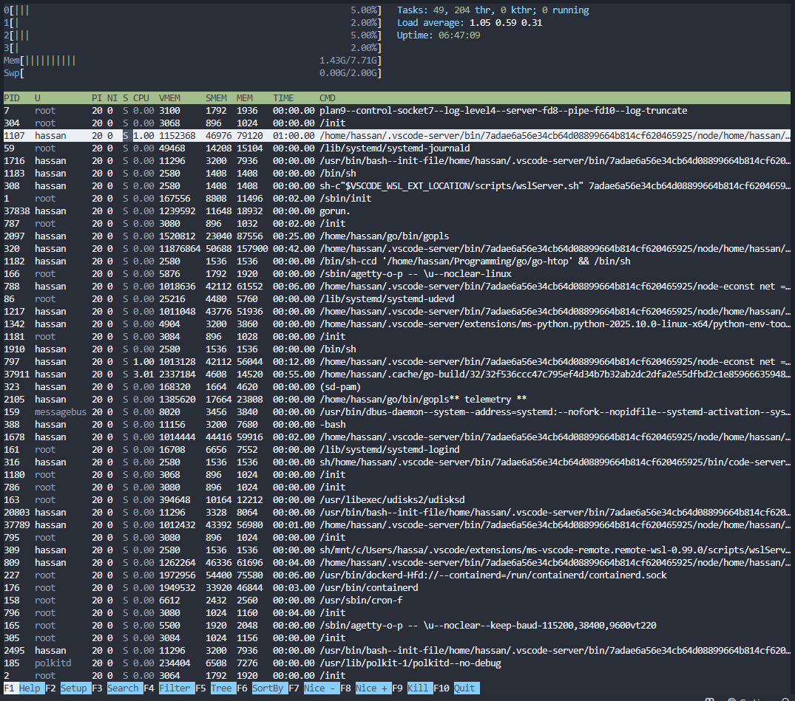
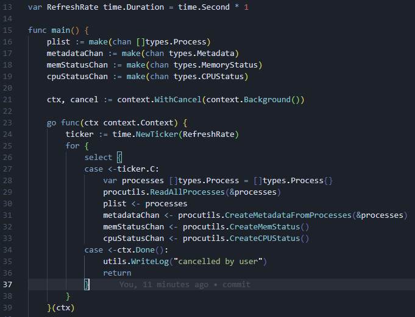
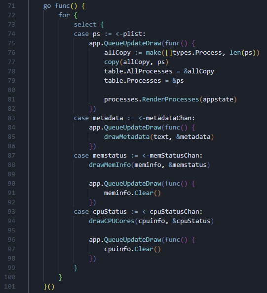

**A clone of htop, written in Go.**

I built this just as a learning project. I wanted to understand how operating systems manage processes under the hood. After building this project, I feel very confident about those topics.

This isn't a complete 100% clone of htop. There's probably some features that I haven't cloned. I basically just opened htop, picked out as many features as I could, and then implemented their functionality in Go in my own way.

While this isn't a complete clone of htop's features, it's still definitely usable in prod environments. Though honestly, just use the tried-and-tested htop. What I have here is just a clone for learning purposes.

## Architectural Overview
The main app works by having two goroutines performing two operations:

1. One goroutine reads and parses all system processes from the `/proc` directory, and sends the results to some channels.

2. Another goroutine reads from these channels and displays the data in the terminal, using `tview` and `tcell`.

## Known Limitations
- Kernel Threads aren't being counted. The `kthr` field is literally hardcoded to be 0. I'm not gonna bother with that because I've just found a more fun project to work on that's taking up my days now.
- The "Setup" function doesn't actually do anything right now. Since I didn't clone all of htop's features (just the main ones), there wasn't really many options to customize, hence the "Setup" function is pretty unnecessary and honestly just there to look like htop.

## About Me
Hassan Aziz

[My Website](https://www.hassandev.me) \
[Twitter/X](https://x.com/nothassanaziz) \
[YouTube](https://www.youtube.com/@itshassanaziz)